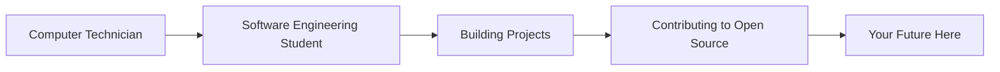

# 👋 Gonçalo Silva

## 🗺️ My Journey


### 📍 Where I Am Now
- 🎓 **Education:** Software Engineering Student
- 💼 **Current Role:** Computer Technician
- 🌍 **Location:** Portugal
- 🎯 **Goal 2024:** [teu objetivo]

### 🎯 2024 Goals Progress
```text
Master Data Structures     ████████░░ 80%
Learn Cloud Computing      ██████░░░░ 60%
Build 5 Projects           ████░░░░░░ 40%
Contribute to Open Source  ██░░░░░░░░ 20%
```

### 📫 Let's Connect
📧 goncalo6silvaa@gmail.com | 💼 [LinkedIn](link)
